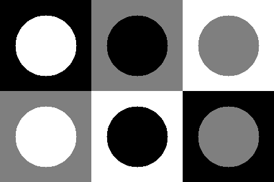
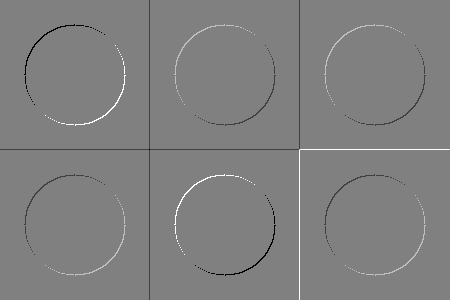
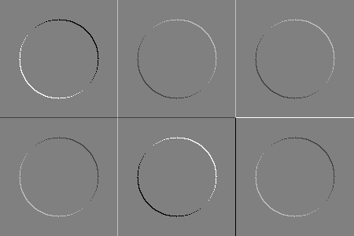
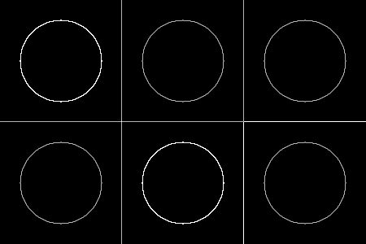

## Работа К. фильтрация изображений
автор: Тхор И.Н.
дата: 2022-05-17T19:30:04
хранилище: <ВСТАВИТЬ ССЫЛКУ НА КОД>

### Задание
0. текст, иллюстрации и подписи отчета придумываем самостоятельно
1. нарисовать
- одноканальное изображение 
- поле 2x3 из квадратных клеток 150x150px черного, белого и серого (127) цвета (соседние цвета разные)
- в цетре клеток - круг другого цвета (все сочетания перебрать)
2. отфильтровать и визуализировать I1 (фильтр вида)
1 0
0 -1
3. отфильтровать и визуализировать I2 (фильтр вида)
0 1
-1 0
4. вычислить и визуалиировать геометрическое среднее (корень из суммы квадратов I1 и I2)

### Результаты

  
Рис. 1. Первоначально созданное изображение

  
Рис. 2. Полученное изображение I1 после применения фильтра

  
Рис. 3. Полученное изображение I2 после применения фильтра

  
Рис. 4. Матрица геометрического среднего

### Текст программы

```cpp
#include <opencv2/opencv.hpp>

int main() {
	
	cv::Mat ImgSrc(300, 450, CV_32FC1);
	// Создаем 2 поля черного цвета
	for (int i = 0; i < 150; i++) {
		for (int j = 0; j < 150; j++) {
			ImgSrc.at<float>(i, j) = 0;
			ImgSrc.at<float>(i + 150, j + 300) = 0;
		}
	}
	
	// Создаем 2 поля серого цвета
	for (int i = 0; i < 150; i++) {
		for (int j = 150; j < 300; j++) {
			ImgSrc.at<float>(i, j) = 127 / 255.0;
			ImgSrc.at<float>(j, i) = 127 / 255.0;
		}
	}
	
	// Создаем 2 поля белого цвета
	for (int i = 150; i < 300; i++) {
		for (int j = 150; j < 300; j++) {
			ImgSrc.at<float>(i, j) = 255 / 255.0;
			ImgSrc.at<float>(i - 150, j + 150) = 255 / 255.0;
		}
	}

	// Создаем круги в полях черного цвета
	cv::circle(ImgSrc, cv::Point(75, 75), 50, 255 / 255.0, -1);
	cv::circle(ImgSrc, cv::Point(375, 225), 50, 127 / 255.0, -1);

	// Создаем круги в полях серого цвета
	cv::circle(ImgSrc, cv::Point(225, 75), 50, 0 / 255.0, -1);
	cv::circle(ImgSrc, cv::Point(75, 225), 50, 255 / 255.0, -1);

	// Создаем круги в полях белого цвета
	cv::circle(ImgSrc, cv::Point(225, 225), 50, 0 / 255.0, -1);
	cv::circle(ImgSrc, cv::Point(375, 75), 50, 127 / 255.0, -1);

	// Прописываем фильтры
	cv::Mat I1(2, 2, CV_32S);
	I1 = 0;
	I1.at<int>(0, 0) = 1;
	I1.at<int>(1, 1) = -1;

	cv::Mat I2(2, 2, CV_32S);
	I2 = 0;
	I2.at<int>(0, 1) = 1;
	I2.at<int>(1, 0) = -1;

	// Применяем фильтры
	cv::Mat I1_filtered = ImgSrc.clone();
	I1_filtered = 0;
	cv::filter2D(ImgSrc, I1_filtered, -1, I1, cv::Point(0, 0));

	cv::Mat I2_filtered = ImgSrc.clone();
	I2_filtered = 0;
	cv::filter2D(ImgSrc, I2_filtered, -1, I2, cv::Point(0, 0));

	// Создаем матрицу геометрического среднего
	cv::Mat middle(ImgSrc.size(), CV_32FC1);
	for (int i = 0; i < I1_filtered.rows; i++) {
		for (int j = 0; j < I1_filtered.cols; j++) {
			middle.at<float>(i, j) = std::sqrt(I1_filtered.at<float>(i, j) * I1_filtered.at<float>(i, j) + I2_filtered.at<float>(i, j) * I2_filtered.at<float>(i, j));
		}
	}

	// Нормируем изображение
	I1_filtered = (I1_filtered + 1) / 2;
	I2_filtered = (I2_filtered + 1) / 2;

	//Сохраняем изображения
	cv::imwrite("ImgSrc.png", ImgSrc * 255);
	cv::imwrite("I1.png", I1_filtered * 255);
	cv::imwrite("I2.png", I2_filtered * 255);
	cv::imwrite("middle.png", middle * 255);

	return 0;
}
```
